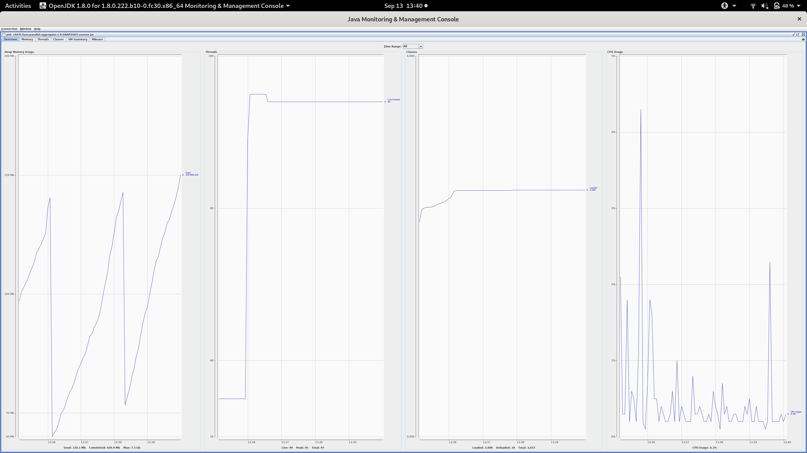

# fuse-parallel-aggregate

Local Java
```
mvn package -DskipTests
java -jar target/fuse-parallel-aggregate-1.0-SNAPSHOT-runner.jar
```

Local Native
```
export GRAALVM_HOME=/opt/graalvm-ce-1.0.0-rc16
mvn package -Pnative -DskipTests -Dnative-image.docker-build=true
./target/fuse-parallel-aggregate-1.0-SNAPSHOT-runner
```


